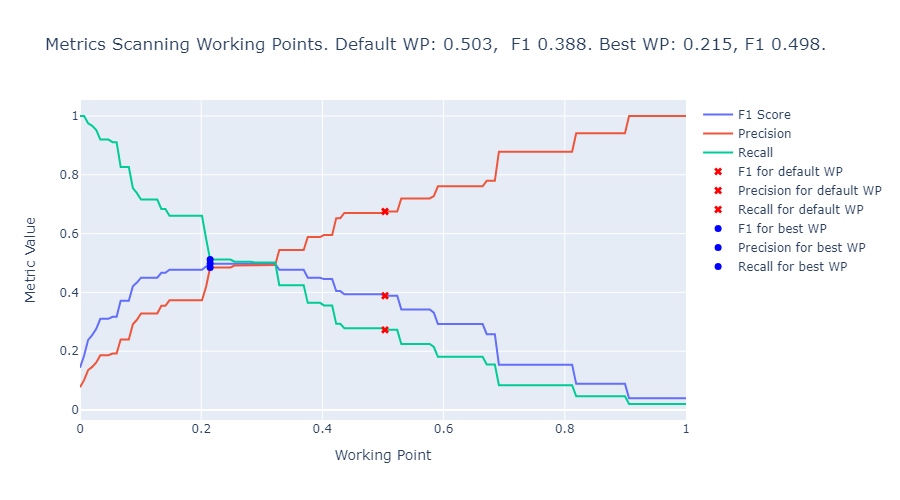
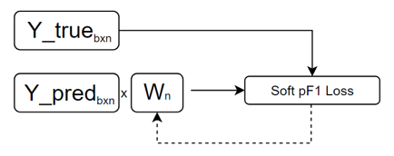

# Multiclass Working Point Fixer

This repository contains the `multiclass_Working_Point_Fixer` class, which is designed to handle and fix the decision threshold or working point in a multiclass classification problem. The class is located in the `src.classification.multiclass_working_point_fixer` module.

## Table of Contents
- [Methodology](#methodology)
- [Installation](#installation)
- [Usage](#usage)
- [Methods](#methods)
- [Examples](#examples)
- [Contributing](#contributing)
- [License](#license)

## Methodology

### Introduction

In binary classification problems, using standard metrics like accuracy can be misleading because they do not account for class imbalance effectively. Other metrics such as Precision, Recall or its harmonic mean, the F1-score, can focus on the performance across classes.

When processing the probability outputs, using the default working point (0.5) to decide whether the sample belongs to class 0 or class 1 might not always be the best decision. This can be easily handled by sweeping the working point and choosing the one that satisfies the problem necessities, commonly, seeking to maximize the F1-score.

Let's see an example:


<p align="left"><em>Figure 1: Training Precision, Recall, and F1-Score</em></p>


<p align="left"><em>Figure 2: Validation Precision, Recall, and F1-Score</em></p>

On the other hand, in multiclass classification problems, it's hard to decide which working point to use since each sample can belong to one of N classes, each one with its own probability.

To solve this, we realized that, in binary classification problems, using the default threshold, was equivalent to choosing the highest probability in multiclass classification problems:

Binary output example:
* class 0 probability = 0.6
* class 1 probability = 0.4

Using default working point, we'll choose class 0. 

Multiclass output example:
* class 0 probability = 0.3
* class 1 probability = 0.4
* class 2 probability = 0.3

Using default working point means choosing the highest probability, so class 1.

### Solution

In this repository, we design a torch module that finds a weight vector that, when multiplied to a multiclass problem probabilities output, returns a weighted probabilities output with which we can decide the class to which the sample belong just by choosing the highest probability.

This achievement is done by training the weight vector, minimizing a customized loss via backpropagation. This customized loss is built using the probabilistic F1-score, a probabilistic implementation of the F1-score (soft_pF1) in order to be derivative [1]. This way, when convergence criteria are achieved, we obtain a weighted vector that minimizes the loss and maximizes the F1 score.

(TODO: Añadir fórmula de la Soft pF1 loss)


<p align="left"><em>Figure 3: W vector trainning</em></p>

In the image above, Y_true represents the true sample labels, a matrix of b samples and n classes, each sample belongs just to one class. Y_pred represents the model probability predictions, a matrix of b samples and n classes, where each sample has n different probabilities (one per class, that sum up to one).

In the other hand, the W vector is a n-size vector.

The process for training the W vector is similar to any NN and is the following:

1. We have the true label matrix of a multiclass problem (Y_true) and its model final prediction (Y_pred).
2. We initialized the W vector with ones (so no alteration is made during the first epoch and the same F1-score is achieved).
3. Compute the soft pF1 loss.
4. Run backpropagation and update the W vector.
5. Repeat 3 and 4 until convergence is achieved.

### Validation of the solution

Since this is a vectorial way of searching for the optimal working point, it must work also in binary problems. Let's check the following graph, obtained from the same example in Figure 1 and 2 in the introduction:


<p align="center"><em>Figure 4: Train and Validation partition Loss. Default working point F1-score vs W vector F1-score</em></p>

As we can see, the optimal point for both train and validation partitions achieves an F1-score that coincides with the manual working point sweeping in Figures 1 and 2:

* Train partition:
    - default WP F1-score = 0.38
    - best WP F1-score = 0.49

* Validation partition:
    - default WP F1-score = 0.28
    - best WP F1-score = 0.46

### Considerations

1. This solution is just a vectorized version of the binary solution to solve the working point problem in multiclass situations.
2. It can automatically improve model performance by changing the decision criterias. It might leave the model as it is, but never decrease the performance.
3. There's no need to retrain the model.

### Future work

1. Implement empirical demonstration
2. Explore new losses based on metrics that we want to maximize.

## Installation

To use the `multiclass_Working_Point_Fixer` class, you need to clone this repository and install the required dependencies.

```bash
git clone https://github.com/isllabres/Multiclass-Working-Point-Fixer.git
cd Multiclass-Working-Point-Fixer
pip install -r requirements.txt
```

## Usage

The `multiclass_Working_Point_Fixer` class is used to adjust and fix a vectorized version of the decision threshold or working point for multiclass classification models. It's build as a NN using PyTorch, using gradient descent, an optimizer, and backpropagation methodology using the described loss.

Below you will find a detailed description of how to use this class.

### Importing the Class

```python
from src.classification.multiclass_working_point_fixer import multiclass_Working_Point_Fixer
```

### Initializing the Class

```python
fixer = multiclass_Working_Point_Fixer(parameters)
```

### Parameters

`parameters`: A dictionary containing the necessary parameters for initializing the class. It contain the following parameters:

- `input_size`: number of classes. Size of the input array.
- `learning_rate`: step size towards loss minimum point.
- `momentum`: in gradient descent methodology, the momentum defines an interia in a direction.
- `centered`: gradients normalization by the estimated variance of the gradient [2].
- `num_epochs`: Number of times the whole dataset will be processed by the `multiclass_Working_Point_Fixer`
- `multiclass_f1_average`: average methodology ‘micro’, ‘macro’, ‘samples’, ‘weighted’, ‘binary’ [3]
- `train_batch_size`: number of samples per iteration in train setp. If `train_batch_size` == `y_train_true.shape[0]`, first iteration will return the same F1 for old F1 and new F1.
- `val_batch_size`: number of samples per iteration in train setp. If `val_batch_size` == `y_test_true.shape[0]`, first iteration will return the same F1 for old F1 and new F1.

## Methods

### `fit`

This method adjusts the multiclass working point vector for the given multiclass classification model.

```python
fixer.fit(
    x_tr=y_train_pred,
    y_tr=y_train_true,
    x_tst=y_test_pred,
    y_tst=y_test_true,
    plot=True)
```

- `x_tr`: numpy array with the train input data.
- `y_tr`: numpy array with the train expected output.
- `x_tst`: numpy array with the test input data.
- `y_tst`: numpy array with the test expected output.
- `plot`: boolean indicating whether to plot or not train-val losses and F1 vs F1w scores.

### `plot_class_f1_scores`

This method shows the obtained weighted F1-score for the model after fixing the multiclass working point vector.

```python
fixer.plot_class_f1_scores(
    x=y_train_pred,
    y=y_train_true,
    c_names=list(y_test_true))
```

- `x`: numpy array with the model input.
- `y`: numpy array with the expected output.
- `c_names`: List of class names.

## Examples

An example on how to use the class with output labels and prediction of real binary and multiclass problems (with anonimized class names) is available in the notebook:

- `tutorial_multiclass_working_point_fixer.ipynb`

## References

- [1] Dustin Axman and Reda Yacouby, "Probabilistic extension of precision, recall, and F1 score for more thorough evaluation of classification models", 2020.
- [2] RMSprop optimizer https://pytorch.org/docs/stable/generated/torch.optim.RMSprop.html
- [3] Sklearn F1-score https://scikit-learn.org/stable/modules/generated/sklearn.metrics.f1_score.html
