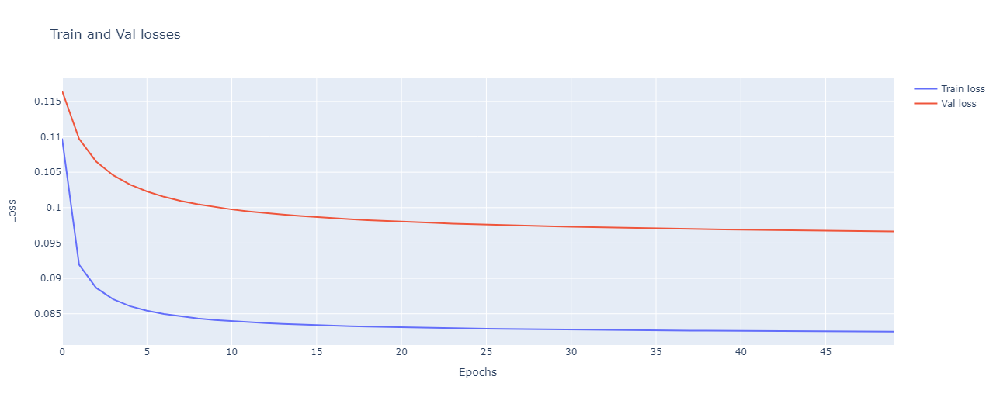

# Multiclass Working Point Fixer

This repository contains the `multiclass_Working_Point_Fixer` class, which is designed to handle and fix the decision threshold or working point in a multiclass classification problem. The class is located in the `src.classification.multiclass_working_point_fixer` module.

## Table of Contents
- [Methodology](#methodology)
- [Installation](#installation)
- [Usage](#usage)
- [Methods](#methods)
- [Examples](#examples)
- [Contributing](#contributing)
- [License](#license)

## Methodology

### Introduction

In binary classification problems, using standard metrics like accuracy can be misleading because they do not account for class imbalance effectively. Other metrics such as Precision, Recall or it's armonic mean, the F1-score, can focus on the performance across classes. 

When processing the probabilities outputs, using the default working point (0.5) to decide whether the sample belong to class 0 or class 1 might not always be the best decission. This can be easily handled by sweeping the working point and choosing the one that satisfies the problem neccessities, commonly, seeking to maximize the F1-score.

Let's see an example:


<p align="left"><em>Figure 1: Training Precision, Recall, and F1-Score</em></p>


<p align="left"><em>Figure 2: Validation Precision, Recall, and F1-Score</em></p>

On the other hand, in multiclass classification problems, it's hard to decide which working point to use since each sample can belong to one of N classes, each one with it's own probability.

To solve this, we realized that, in binary classification problems, using the default threshold, was equivalent to choosing the highest probability in multiclass classification problems:

Binary output example:
* class 0 probability = 0.6
* class 1 probability = 0.4

Using default working point, we'll choose class 0. 

Multiclass output example:
* class 0 probability = 0.3
* class 1 probability = 0.4
* class 2 probability = 0.3

Using default working point means choosing the highest probability, so class 1.

### Solution

In this repository, we design a torch module that finds a weight vector that, when multiplied to a multiclass problem probabilities output, returns a weighted probabilities output with which we can decide the class to which the sample belong just by choosing the highest probability.

This achievement is done by trainning the weight vector, minimizing a customized loss via backpropagation. This customized loss is built using the probabilistic F1-score, a probabilistic implementation of the F1-score (soft_pF1) in order to be derivative (referenciar paper). This way, wen convergence criteria is achieved, we obtain a weighted vector that minimizes the loss and maximizes de F1 score.

$$
\text{soft\_pF1\_loss} = 1 - \text{soft\_pF1}
$$


<p align="left"><em>Figure 3: Soft probabilistic F1 Loss</em></p>

In the image aboce, Y_true represents the true sample labels, a matrix of b samples and n classes, each sample belong just to one class. Y_pred represents the model probability predictions, a matrix of b samples and n classes, where each sample has n different probabilities (one per class, that sum up to one). 

In the other hand, the W vector is a n-size vector.

The process for trainning the W vector is similar to any NN and is the following:

1. We have the true label matrix os a multiclass problem (Y_true) and its model final predicion (Y_pred).
2. We initialized the W vector with ones (so no alteration is made during the first epoch and the same F1-score is achieved).
3. Compute the soft pF1 loss.
4. Run backpropagation and update the W vector.
5. Repeat 3 and 4 until convergence is achieved.

### Validation of the solution

Since this is a vectorial way of searching for the optimal woriking point, must work also in binary problems. Let's check the following graph, obtained from the same example in Figure 1 and 2 in the introduction:


<p align="center"><em>Figure 4: Train and Validation partition Loss. Default working point F1-score vs W vector F1-score</em></p>

As we can see, the optimal point for both train and validation partition, achieve an F1-score that coindice with the manual working point sweeping in figures 1 and 2:

* Train partition:
    - default wp F1-score = 0.38
    - best wp F1-score = 0.49

* Validation partition:
    - default wp F1-score = 0.28
    - best wp F1-score = 0.46

### Considerations

1. This solution is just a vectorized version of the binary solution to solve the working point problem in multiclass situations.
2. It can automatically improve model performance by changing the decision criterias. It might leave the model as it is, but never decrease the performance.
3. There's no need to retrain the model.

### Future work

1. Implement empirical demonstratino
2. Explore new losses based on metrics that we want to maximize.

## Installation

To use the `multiclass_Working_Point_Fixer` class, you need to clone this repository and install the required dependencies.

```bash
git clone https://github.com/yourusername/yourrepository.git
cd yourrepository
pip install -r requirements.txt
```

## Usage

The `multiclass_Working_Point_Fixer` class is used to adjust and fix working points for multiclass classification models. Below is a detailed description of how to use this class.

### Importing the Class

```python
from src.classification.multiclass_working_point_fixer import multiclass_Working_Point_Fixer
```

### Initializing the Class

```python
fixer = multiclass_Working_Point_Fixer(parameters)
```

### Parameters

- `parameters`: A dictionary containing the necessary parameters for initializing the class.

## Methods

### `fix_working_points`

This method adjusts the working points for the given multiclass classification model.

```python
fixer.fix_working_points(model, data)
```

- `model`: The multiclass classification model to be adjusted.
- `data`: The data on which the model is evaluated.

### `evaluate_model`

This method evaluates the model after fixing the working points.

```python
fixer.evaluate_model(model, data)
```

- `model`: The multiclass classification model to be evaluated.
- `data`: The data on which the model is evaluated.

## Examples

Here is a simple example of how to use the `multiclass_Working_Point_Fixer` class:

```python
from src.classification.multiclass_working_point_fixer import multiclass_Working_Point_Fixer

# Initialize the fixer with parameters
parameters = {
    'param1': value1,
    'param2': value2,
    # Add other parameters as needed
}
fixer = multiclass_Working_Point_Fixer(parameters)

# Fix working points for the model
fixer.fix_working_points(model, data)

# Evaluate the model
results = fixer.evaluate_model(model, data)
print(results)
```

## Contributing

Contributions are welcome! Please read the [contributing guidelines](CONTRIBUTING.md) before getting started.

## License

This project is licensed under the MIT License. See the [LICENSE](LICENSE) file for details.